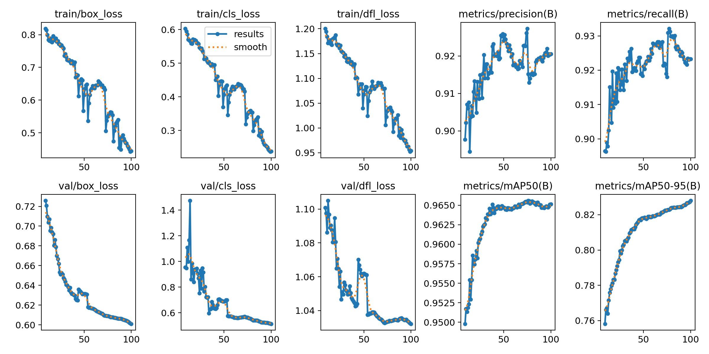

# 🐘 WildEye - Elephant Detection and Alert System  

[](https://www.python.org/)  
[](https://www.djangoproject.com/)  
[](https://github.com/ultralytics/ultralytics)  
[](https://www.postgresql.org/)  

---

## 📌 Overview  

**WildEye** is an AI-powered monitoring and alert system designed to detect elephants in real time and help mitigate **human-elephant conflict**.  

The system integrates:  
- **YOLOv8** → for real-time elephant detection  
- **DeepSORT** → for object tracking across video frames  
- **Django** → backend for alert management and APIs  
- **PostgreSQL** → database for storing detections and alerts  

> ⚡ Goal: Provide early warning alerts to nearby communities, reduce crop damage, property loss, and save lives.  

--- 

## ✨ Features  

- 🐘 Real-time elephant detection  
- 🎯 Multi-object tracking using **DeepSORT**  
- 🌐 Django backend for managing detections & alerts  
- 🗄 PostgreSQL database integration  
- 🚨 Alerts are sent via **email** and **siren sound** to notify users of elephant detection  
- 👤 Three types of users:  
  - **Normal User** → Can view alerts and history  
  - **Admin** → Accessed via `/custom_admin` for advanced management  
  - **Developer** → Can manage system settings and model configurations  
- 📊 Previous detections displayed as **cards** and **tables** for analysis  
- 🔍 Tables include a **search feature** to find particular data efficiently, implemented using a **SORT algorithm**  
- 💡 Extensible for IoT integration, dashboards, and other alert mechanisms  

---

## ⚡ Advanced Features  

- 🧹 **Automatic buffer cleaning** → Frees memory to maintain performance during long monitoring sessions  
- 🔑 **OTP-based account creation and password recovery** → Secure sign-up and password reset  
- 🗂 **Headers and footers for easy accessibility** → Simplifies navigation across the web interface  
- ⏳ **Preloader** → Improves user experience by showing a loading indicator while the system or pages load  

---
## 🧠 YOLOv8 Model Performance  

The YOLOv8 model used for elephant detection achieved the following performance metrics:

| Metric | Value | Description |
|--------|-------|-------------|
| **Precision** | 92.3% | Correct positive detections |
| **Recall** | 93.1% | Correctly identified elephants |
| **mAP@50** | 96.5% | High accuracy at standard IoU threshold |
| **mAP@50-95** | 83.0% | Performance across different IoUs |

### Confusion Matrix
 <!-- Replace with your confusion matrix image path -->

### Training and Validation Losses
 <!-- Replace with your training/validation plot image path -->

---

## 🛠 Installation  

### 1️⃣ Clone the repository  
```bash
git clone git@github.com:ItsAlbinGeorge/WildEye-Elephant-Detection-and-Alert-System.git
cd WildEye-Elephant-Detection-and-Alert-System
```
### 2️⃣ Navigate into the project directory
```bash
cd WildEye-Elephant-Detection-and-Alert-System
```
### 3️⃣ Create & Activate Virtual Environment (Windows)
```bash
# Install virtualenvwrapper-win
pip install virtualenvwrapper-win

# Create a new virtual environment
mkvirtualenv wildeye_env

# Activate the environment
workon wildeye_env
```
### 4️⃣ Install Dependencies  
```bash
pip install -r requirements.txt
```
### 5️⃣ Set up PostgreSQL
1. Install PostgreSQL on your system.
2. Install pgAdmin on your system. 
3. Create a database (e.g., `WildEye`).  
4. Update the `DATABASES` section in `settings.py` (Django settings) with your database name, user, password, and host.

### 6️⃣ Create Django Migrations  
```bash
python manage.py makemigrations
```
### 7️⃣ Run Django Migrations  
```bash
python manage.py migrate
```
### 8️⃣ (Optional) Create Django Superuser  
```bash
python manage.py createsuperuser
```
### 9️⃣ Start Django Server  
```bash
python manage.py runserver
```
> By default, the backend will be available at: http://127.0.0.1:8000/

For more details, check out the [Canva presentation](https://www.canva.com/design/DAGdlk2gjhE/4pEBbz0zLjWbHfA6dKBdag/edit?utm_content=DAGdlk2gjhE&utm_campaign=designshare&utm_medium=link2&utm_source=sharebutton).
